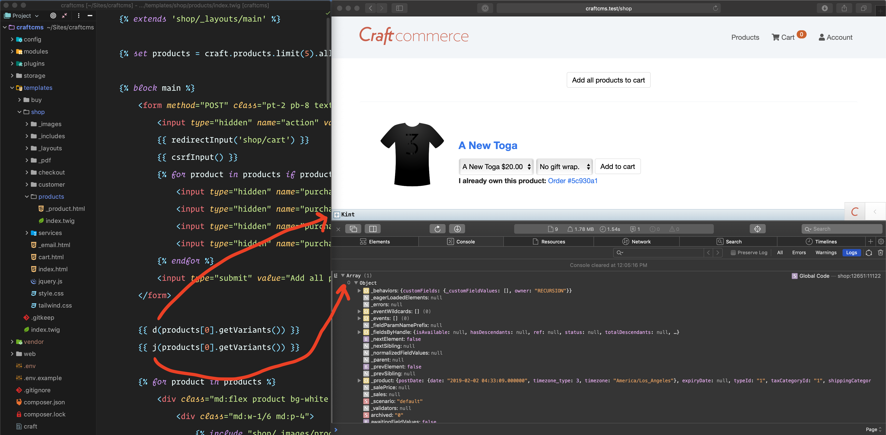

# Kint plugin for Craft CMS 3.x

Adds Kint, an in-app PHP debugger, to Craft CMS 3.x for use in Twig and PHP.

## Requirements

This plugin requires Craft CMS 3.0 or later.

## Installation

To install the plugin, follow these instructions.

1. Open your terminal and go to your Craft project:

        cd /path/to/project

2. Then tell Composer to load the plugin:

        composer require mildlygeeky/craft-kint

3. In the Control Panel, go to Settings → Plugins and click the “Install” button for Kint.

## Kint Overview

Kint is an interactive debugger for PHP applications. Full documentation is available at http://raveren.github.io/kint/.

Its advantages include that it can be run out of devMode (though you would not want to use it in a public setting), and
it is interactive, with keyboard shortcuts to expand and collapse objects, separates content from methods, etc.

## Configuring Kint

No configuration required, but you can set the theme that Kint will use within the plugin's settings screen.

## Using Kint

### Templating

#### d (dump)

`{{ d(someTwigVariable) }}`

This is the simplest usage, and will output an interactive debugger for the variable passed in.

#### j (dump - console.log())

`{{ j(someTwigVariable) }}`

This is the same as `d`, except all output will be sent to `console.log()`

#### dd (dump and die)

`{{ dd(someTwigVariable) }}`

This works the same way as the d (dump) command, except it will cause output to end immediately after the debugger is returned.

#### s (simple dump)

`{{ s(someTwigVariable) }}`

This works essentially the same way as the built-in Twig dump method, and returns a plain text debugging output.

#### sd (simple dump and die)

`{{ sd(someTwigVariable) }}`

Same as above, but with output ending immediately after the plain text debugging output is returned.

#### time (point-in-time memory usage and timestamp)

`{{ time() }}`

Basic reporting of memory usage at the time that the command is run, as well as a timestamp. If used multiple times,
it will also report the time since it was last called and average duration.

Brought to you by [Mildly Geeky, Inc.](https://mildlygeeky.com)
